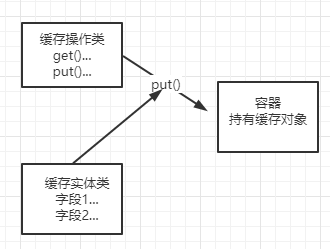
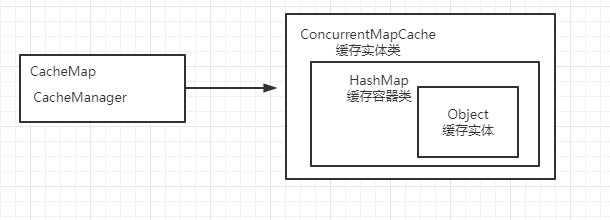
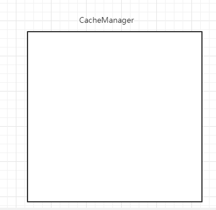
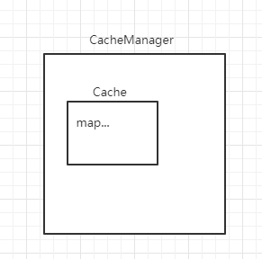

# 缓存设计

# 1. 前言

在写代码的时候缓存可以说是用的比较多了，主要还是用来缓存已经查询出的一些数据方便下一次能够更加快速的获取对应的结果，比如同一条sql或者以及比较复杂的sql等等，其中比较出名的就是redis缓存了，因为基于内存操作且是分布式的缓存所以项目中用的比较多了，但是一般的框架也会实现本地缓存，在现在分布式项目下，本地缓存无法跨过服务器所以用处被降低，但是大多数项目还是会设置本地缓存，毕竟不可能让别人使用你的框架还得先开启一个redis才能使用，这样不合理也没必要，所以想根据市面上框架的缓存设计进行学习和总结以便加深自己对缓存的了解。

## 1.1 技术选型

首先要有点基本概念，就是怎么考虑一个缓存，第一个就是缓存的存储类，毕竟缓存，缓存总得有个类来存，第二个就是缓存的操作，可以往容器中添加，那第三个就是容器了，用来存储我们的缓存对象。不过其实用HashMap作为底层也ok，就平常我们学spring框架，BeanFactory是工厂的基础操作类，而BeanDefiniton才是真正的对象包装类，看上去的关系就如下。



目前所研究的框架主要有以下几个

1. google.guava

   ```java
   /**
    * key-value的缓存形式，存储到缓存中直到被手动释放或者驱逐
    * 该接口的实现是线程安全的并且可以由多个线程并发安全的访问
    */
   @Beta
   @GwtCompatible
   public interface Cache<K, V> {
   
     /**
      * 返回与Key关联的值，如果没有缓存该key则返回null
      */
     @Nullable
     V getIfPresent(Object key);
   
     
       /**
       * 返回此缓存将指定键映射到的值，并在必要时从{@code valueLoader}获取该值。 此方法为常规的“如果已缓存，则返回；否则创建，缓存并返回”模式提供了简单的替代方法。
   	* 如果可能的话，实现应确保加载操作是同步的，以便在同时访问同一键的情况下，仅调用一次指定的{@code valueLoader}。
       */
     V get(K key, Callable<? extends V> valueLoader) throws ExecutionException;
   
    
     ImmutableMap<K, V> getAllPresent(Iterable<?> keys);
   
     
     void put(K key, V value);
   
    
     void putAll(Map<? extends K,? extends V> m);
   
     /**
      * 清除该键的所有缓存之
      */
     void invalidate(Object key);
   
     /**
      * 清除该键的所有缓存之
      *
      * @since 11.0
      */
     void invalidateAll(Iterable<?> keys);
   
     /**
      * 清除所有键
      */
     void invalidateAll();
   
     /**
      * 返回该缓存的entries数量hk;
      */
     long size();
   
     /**
      * 返回此缓存的累积统计信息的当前快照。 所有统计信息均初始化为零，并在缓存的整个生命周期内单调增加。
      */
     CacheStats stats();
   
     /**
      * 以线程安全映射的形式返回存储在此缓存中的entries的视图。 对map的修改将直接影响缓存。
      */
     ConcurrentMap<K, V> asMap();
   
     /**
      * 执行缓存所需的所有暂挂维护操作。 究竟要执行的活动（如果有）取决于实现。
      */
     void cleanUp();
   }
   ```

2. spring-context

   ```java
   /**
    * 通用的接口操作工具类
    *
    * <b>Note:</b> 推荐允许存储null值，比如方法返回null
    */
   public interface Cache {
   
      
      String getName();
   
      /**
       * 返回底层native缓存提供程序。
       */
      Object getNativeCache();
   
      @Nullable
      ValueWrapper get(Object key);
   
      /**
       * 将返回值转换成指定的type类型
       */
      @Nullable
      <T> T get(Object key, @Nullable Class<T> type);
   
      /**
       * 返回此缓存将指定键映射到的值，并在必要时从{@code valueLoader}获取该值。 此方法为常规的“如果已缓存，则返回；否则创建，缓存并返回”模式提供了简单的替代方法。
   	* 如果可能的话，实现应确保加载操作是同步的，以便在同时访问同一键的情况下，仅调用一次指定的{@code valueLoader}。
       */
      @Nullable
      <T> T get(Object key, Callable<T> valueLoader);
   
      
      void put(Object key, @Nullable Object value);
   
      /**
       * 先从缓存获取，如果不存在则进行插入
       * <pre><code>
       * ValueWrapper existingValue = cache.get(key);
       * if (existingValue == null) {
       *     cache.put(key, value);
       * }
       */
      default ValueWrapper putIfAbsent(Object key, @Nullable Object value) {
         ValueWrapper existingValue = get(key);
         if (existingValue == null) {
            put(key, value);
         }
         return existingValue;
      }
   
      /**
       * 清除指定key
       */
      void evict(Object key);
   
      /**
       * 委托给evict执行，如果没有或者不确定之前存在该key，则返回false
       */
      default boolean evictIfPresent(Object key) {
         evict(key);
         return false;
      }
   
      /**
       * 清除所有映射
       */
      void clear();
   
      /**
       * 清除所有映射
       * {@code true} 如果之前有缓存映射
       * {@code false} 如果没有或者无法确定之前是否存在entries
       */
      default boolean invalidate() {
         clear();
         return false;
      }
   
   
      /**
       * 缓存包装对象
       */
      @FunctionalInterface
      interface ValueWrapper {
   
         /**
          * 返回真实值
          */
         @Nullable
         Object get();
      }
   
   
      /**
       * 值加载程序回调失败而引起异常
       * 
       */
      class ValueRetrievalException extends RuntimeException {
   
         @Nullable
         private final Object key;
   
         public ValueRetrievalException(@Nullable Object key, Callable<?> loader, Throwable ex) {
            super(String.format("Value for key '%s' could not be loaded using '%s'", key, loader), ex);
            this.key = key;
         }
   
         @Nullable
         public Object getKey() {
            return this.key;
         }
      }
   
   }
   ```

3. shiro-cache

   ```java
   /**
    * 此接口在基础缓存框架的缓存实例（例如JCache，Ehcache，JCS，OSCache，JBossCache，TerraCotta，Coherence，GigaSpaces等）之上提供了一个抽象（包装器）API，从而允许Shiro用户配置任何 他们选择的缓存机制。
    */
   public interface Cache<K, V> {
   
      
       public V get(K key) throws CacheException;
   
       
       public V put(K key, V value) throws CacheException;
   
       
       public V remove(K key) throws CacheException;
   
       
       public void clear() throws CacheException;
   
       
       public int size();
   
       
       public Set<K> keys();
   
      
       public Collection<V> values();
   }
   ```

4. ibatis

   ```java
   /**
     * SPI用于缓存提供程序。
     * 将为每个名称空间创建一个缓存实例。
     *缓存实现必须具有一个构造函数，该构造函数将缓存ID作为String参数接收。
     * MyBatis将把名称空间作为ID传递给构造函数。
     * public MyCache(final String id) {
     *  if (id == null) {
     *    throw new IllegalArgumentException("Cache instances require an ID");
     *  }
     *  this.id = id;
     *  initialize();
     * }
     */
   public interface Cache {
   
     /**
      * 获取缓存id
      */
     String getId();
   
     
     void putObject(Object key, Object value);
   
     
     Object getObject(Object key);
   
     
     Object removeObject(Object key);
   
     
     void clear();
   
     
     int getSize();
   
     
     default ReadWriteLock getReadWriteLock() {
       return null;
     }
   ```

# 2.实现

对目前框架中Cache接口的方法定义进行总结，基础的方法有get/put/size/evict/clear，有人可能会觉得有点少，不过没关系毕竟这是基础的底层操作接口，之后可以再让其他接口继承这个接口以实现更加多的扩展功能。那么接下来实现我们自己的Cache接口吧。

```java
package com.zxw.cache;

import java.util.concurrent.Callable;

/**
 * @author zxw
 * Cache缓存基础操作类
 * 提升程序性能
 * @date 2020/5/30 18:47
 */
public interface Cache<K, V> {
    /**
     * 获取对应的Value
     *
     * @param Key
     * @return
     */
    V get(K Key);

    /**
     * 将Value转成K的类型
     *
     * @param key
     * @param type
     * @return
     */
    V get(K key, Class<K> type);

    /**
     * @param key
     * @param valueLoader
     * @return
     */
    V get(K key, Callable<? extends V> valueLoader);

    /**
     * 添加缓存
     *
     * @param key
     * @param val
     */
    void put(K key, V val);

    /**
     * 清除K的值
     *
     * @param key
     */
    void evict(Object key);

    /**
     * 清除所有
     */
    void clear();

    /**
     * 返回entries的数量
     * @return
     */
    long size();

    /**
     * 如果该值尚未有关联,则该值尚未设置
     * @param key
     * @param val
     * @return
     */
    default V putIfAbsent(K key, V val) {
        V v = get(key);
        if (v == null) {
            put(key, val);
        }
        return v;
    }
}
```

接下来我们可以提供一个抽象的实现类实现这些基础的操作能够让后面的继承类进行复用。

```java
package com.zxw.cache;

import java.util.IllegalFormatException;
import java.util.concurrent.Callable;

/**
 * @author zxw
 * @date 2020/5/31 10:21
 */
public abstract class AbstractCache<K, V> implements Cache<K, V> {

    private final boolean allowNullValues;

    public AbstractCache(boolean allowNullValues) {
        this.allowNullValues = allowNullValues;
    }

    public final boolean isAllowNullValues() {
        return this.allowNullValues;
    }

    public AbstractCache() {
    }

    @Override
    public V get(K Key) {
        V v = lookup(Key);
        return v;
    }

    @Override
    public V get(K key, Class<K> type) {
        V v = lookup(key);
        if (v != null && type != null && !type.isInstance(v)) {
            throw new IllegalStateException("Cached value is not of required type [" + type.getName() + "]:" + v);
        }
        return v;
    }

    /**
     * 子类实现获取key的逻辑
     *
     * @param key
     * @return
     */
    protected abstract V lookup(K key);
}

```

这里我们使用Object作为底层数据存储对象，以ConcurrentHashMap作为对象存储容器，实现一个map的缓存操作类

```java
package com.zxw.cache.concurrent;

import com.zxw.cache.AbstractCache;
import com.zxw.util.Assert;

import java.util.concurrent.Callable;
import java.util.concurrent.ConcurrentHashMap;

/**
 * @author zxw
 * @date 2020/5/31 11:00
 */
public class ConcurrentMapCache<K, V> extends AbstractCache<K, V> {
    private final String name;
    private final ConcurrentHashMap<K, V> store;
    private final String serialization;

    /**
     * 使用指定的名称创建一个ConcurrentMapCache
     *
     * @param name
     */
    public ConcurrentMapCache(String name) {
        this(name, new ConcurrentHashMap<>(256), true);
    }

    public ConcurrentMapCache(boolean allowNullValues, String name) {
        this(name, new ConcurrentHashMap<>(256), allowNullValues);
    }

    public ConcurrentMapCache(String name, ConcurrentHashMap<K, V> store, boolean allowNullValues) {
        this(name, store, allowNullValues, null);
    }

    public ConcurrentMapCache(String name, ConcurrentHashMap<K, V> store, boolean allowNullValues, String serialization) {
        Assert.isNull(name, "Name must not be null");
        Assert.isNull(store, "store must not be null");
        this.name = name;
        this.store = store;
        this.serialization = serialization;
    }

    @Override
    protected V lookup(K key) {
        return this.store.get(key);
    }

    @Override
    public String getName() {
        return this.name;
    }

    @Override
    public V get(K key, Callable<? extends V> valueLoader) {
        return this.store.computeIfAbsent(key, k -> {
            try {
                return valueLoader.call();
            } catch (Exception e) {
                throw new IllegalArgumentException();
            }
        });
    }

    @Override
    public void put(K key, V val) {
        this.store.put(key, val);
    }

    @Override
    public void evict(Object key) {
        this.store.remove(key);
    }

    @Override
    public void clear() {
        this.store.clear();
    }

    @Override
    public long size() {
        return 0;
    }
}

```

目前使用的是Cache的实现类作为我们的缓存实体以及操作类，HashMap作为字段容器存储缓存实体。


操作操作类和缓存实体都有了，接下来就是我们的缓存容器了，首先定义一个CacheManager管理我们的所有缓存实体。

```java
package com.zxw.cache;

import java.util.Collection;

/**
 * 提供并维护Cache实例的生命周期
 *
 * @author zxw
 * @date 2020/5/31 13:28
 */
public interface CacheManager {
    /**
     * 根据名称获取Cache
     * @param name
     * @param <K>
     * @param <V>
     * @return
     */
    <K, V> Cache<K, V> getCache(String name);

    /**
     * 获取所有的Cache名称
     * @return
     */
    Collection<String> getCacheNames();
}
```

```java
package com.zxw.cache.support;

import com.zxw.cache.Cache;
import com.zxw.cache.CacheManager;

import java.util.Collection;
import java.util.Collections;
import java.util.Set;
import java.util.concurrent.ConcurrentHashMap;

/**
 * @author zxw
 * @date 2020/5/31 13:34
 */
public abstract class AbstractCacheManager implements CacheManager {
    private final ConcurrentHashMap<String, Cache> cacheMap;
    private volatile Set<String> cacheNames;

    public AbstractCacheManager() {
        this(new ConcurrentHashMap<>(16));
    }

    public AbstractCacheManager(ConcurrentHashMap<String, Cache> cacheMap) {
        this(cacheMap, Collections.emptySet());
    }

    public AbstractCacheManager(ConcurrentHashMap<String, Cache> cacheMap, Set<String> cacheNames) {
        this.cacheMap = cacheMap;
        this.cacheNames = cacheNames;
    }

    @Override
    public <K, V> Cache<K, V> getCache(String name) {
        Cache cache = this.cacheMap.get(name);
        // 如果存在该cache，则直接返回
        if (cache != null) {
            return cache;
        }
        // 如果cache不存在，则创建一个cache
        Cache missingCache = getMissingCache(name);
        if (missingCache == null) {
            synchronized (this.cacheMap) {
                cache = this.cacheMap.get(name);
                if (cache == null) {
                    cache = CreateCache(name);
                    cacheMap.putIfAbsent(name, cache);
                }
            }
        }
        return cache;
    }

    public abstract Cache CreateCache(String name);

    protected abstract Collection<? extends Cache> loadCaches();

    @Override
    public Collection<String> getCacheNames() {
        return cacheNames;
    }

    public Cache getMissingCache(String name) {
        return null;
    }
}
```

`private final ConcurrentHashMap<String, Cache> cacheMap;`

这里用一个Map类型存储所有的cache实现类



总结：现在我们从头到尾在重新看一遍这个缓存。首先我们得有个管理器，对所有的缓存类型进行管理。



然后我们需要有个被管理的对象，即缓存



